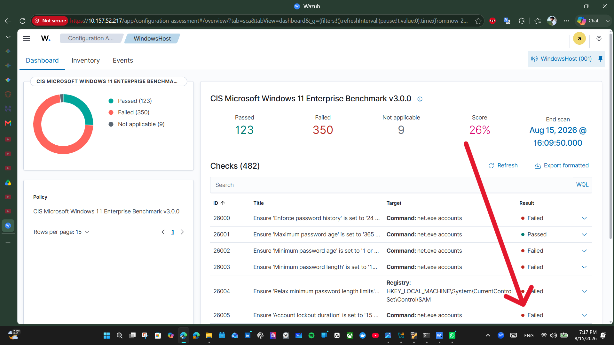
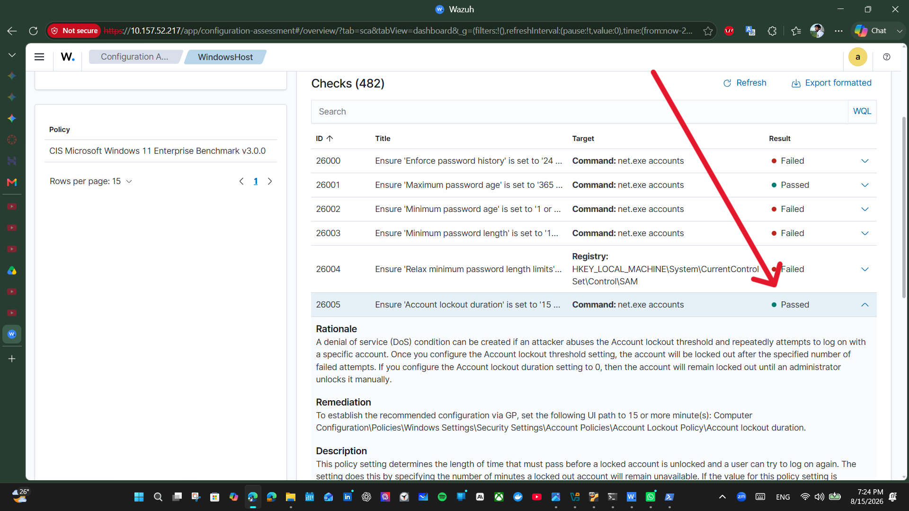

# Lab 02: Wazuh SIEM & XDR Deployment, Threat Detection & Automated Incident Response

## Executive Summary
This project demonstrates an end-to-end deployment of an enterprise Security Information and Event Management (SIEM) and Extended Detection and Response (XDR) architecture using the **Wazuh** platform. The engagement spans server virtualization, secure TLS agent enrollment, real-time File Integrity Monitoring (FIM / Syscheck), brute-force threat detection with multi-event correlation, CIS benchmark compliance auditing, vulnerability lifecycle management (CVE triaging), and automated incident containment using host-level active response scripts.

.png)

---

## Topology & Infrastructure
| Component | Operating System | IP Address | Assigned Roles |
|---|---|---|---|
| **Wazuh Central Manager** | Ubuntu Server 22.04 LTS | `10.157.52.217` | Wazuh Manager Core, OpenSearch Indexer, Wazuh Dashboard (Port 443 HTTPS), Ports 1514 (TCP)/1515 (Authd) |
| **Monitored Endpoint** | Windows 11 Home / Pro | `10.157.52.37` | Wazuh Agent (`001 - WindowsHost`), Windows EventChannel, FIM Engine, SCA Engine, Active Response Executor |

---

## Key Phases & Implementation

### 1. Agent Enrollment & Encrypted Ingestion
- Provisioned the all-in-one Wazuh cluster on Ubuntu 22.04 LTS.
- Enrolled the Windows 11 endpoint agent via administrative PowerShell over TLS (`10.157.52.217:1514`).
- Validated real-time telemetry forwarding via the `windows_eventchannel` decoder.

### 2. Real-Time File Integrity Monitoring (FIM / Syscheck)
- Configured directory auditing on sensitive endpoint paths (`C:\Users\Public\testfolder`).
- Monitored real-time file additions, modifications, and deletions.
- Validated event indexing under the `syscheck` group:
  - **Rule 554 (Level 5):** `File added to the system.`
  - **Rule 553 (Level 7):** `File deleted.`
- **MITRE ATT&CK Mapping:** Defense Evasion (`TA0005` / `T1222`), Data Tampering (`TA0040` / `T1485`).

### 3. Detection Engineering & Multi-Event Correlation
- Simulated automated network credential brute-force attacks over SMB via PowerShell.
- Ingested Windows Event ID `4625` (Logon Failure - Logon Type 3).
- Validated severity escalation from individual failure (**Rule 60122, Level 5**) to correlated brute-force alert (**Rule 60204, Level 10**).
- **MITRE ATT&CK Mapping:** Credential Access: Brute Force (`TA0006` / `T1110.001`).

### 4. Security Configuration Assessment (CIS Hardening)
- Audited system state against **CIS Microsoft Windows 11 Enterprise Benchmark v3.0.0** (482 rules).
- Identified non-compliant account lockout policies:
  - **Check 26005:** Account lockout duration >= 15 min (Failed -> Passed).
  - **Check 26006:** Account lockout threshold <= 5 invalid attempts (Failed -> Passed).
  - **Check 26007:** Reset account lockout counter >= 15 min (Failed -> Passed).
- Remediated configurations via administrative CLI (`net accounts`) and verified real-time score updates.

| Initial Non-Compliant Audit | Remediated Audit (Passed) |
|---|---|
|  |  |

### 5. Vulnerability Management & CVE Triaging
- Correlated installed host applications against the National Vulnerability Database (NVD).
- Triaged critical remote code execution (RCE) flaws:
  - **Package:** VLC Media Player `3.0.16`
  - **Vulnerabilities:** `CVE-2023-47359` (Critical - RCE Buffer Overflow), `CVE-2022-41325` (High), `CVE-2023-46814` (High).

| Vulnerability Overview | Vulnerability Detail Breakdown |
|---|---|
|  |  |

### 6. Automated Incident Containment (SOAR Active Response)
- Configured custom `<active-response>` block in manager `ossec.conf` targeting Rule `60204`.
- Validated dynamic agent-side invocation of `netsh.exe` to isolate the attacker source IP (`127.0.0.1`) with a 180-second automated teardown.
- Verified execution status in `C:\Program Files (x86)\ossec-agent\active-response\active-responses.log`.

---

## Repository Structure